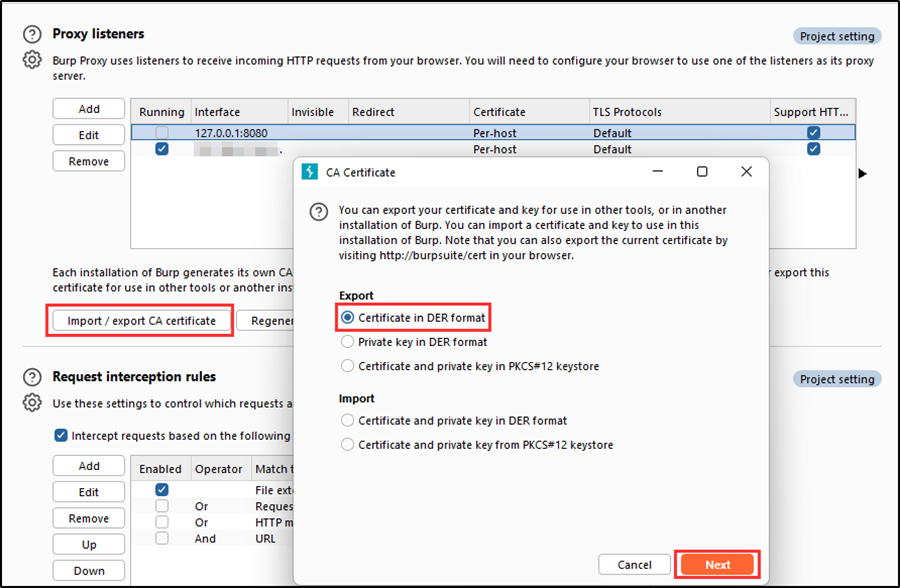
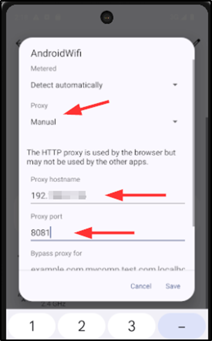

# TLDR

This documentation is a guide on how to successfully connect an android emulator proxy with burp suite for 
Android Penetration Testing. The reason for this is that the official documentation for android studio and most 
YouTube tutorials on how to connect an android emulator with burp suite are a bit implicit. 

## Requirements

-	Android Studio (Any android emulator)
-	Burp Suite (Community Edition or Professional)

**Note**: This tutorial is demonstrated with **Android Studio Hedgehog 2023.1.1 Patch 2** and **Burp Suite Community Edition**.
 
## Step 1: Create a Virtual Device

Navigate to the hamburger on the top left of **android studio** > **Tools** > **Device Manager**

Then click on the plus **(+)** sign on device manager > **Phone** > **select the device you want** > **Next** > **select a system image** > **Next** > **Finish**.

## Step 2: Create a New Proxy Listener in Burp Suite

Create a new proxy listener by navigating to Burp **Settings** > **Proxy** > **Proxy listeners** > **Add** > **Binding** > enter a port in **“Bind to port”** > select **“specific address”** > **select your host ip address in the drop down** > **OK**. 

Then click on **import / export CA certificate** > **certificate in DER format** > **Next** > **select file** > **choose a location to install burp certificate (use a “.crt” file extension to save it)** > **Next**. 
This will generate a burp certificate which will be used on the android emulator.

## Step 3: Install Burp Certificate on the Android Emulator

Cold boot the newly created android emulator and drag/drop the burp certificate exported to your host operating system to the android emulator. 
Then navigate to **Settings** on the android emulator and search for **“Install certificates”** in the search bar. Select the one for **Wi-Fi** > **Install certificates** > **select the burp certificate** > **name it** > **OK**.

Lastly, navigate to the **Wi-Fi settings** of the Android emulator and select the **edit icon** (a pen on the top right). Set the Proxy to **“Manual”**, Proxy hostname to **“your-host-os-ip-address”**, and the Proxy port to the **same port set on burp listener**.

## Step 4: Configure the Android Emulator Proxy Setting

Click on more (the **three dots at the bottom of the device**) to open up **“Extended Controls”**.

In Extended Controls, select **Settings** > **Proxy** > **Manual proxy configuration**. Then set the Host name to your **“host-os-ip-address”**, Port number to the **same port on burp listener**. Then click **“Apply”**. A success Proxy status should be displayed.

## Step 5: Verify that traffic is being intercepted by Burp

Navigate to Proxy and turn on intercept. On the android emulator, search for anything on a web browser and the traffic should be intercepted by burp.

