_image credit: Iperius_

Highly privileged accounts (Domain Admins, Administrators, Enterprise Admins,
etc.) are the ultimate goal for every threat actor or hacker out there. These accounts
are sought after because they have unrestricted access and are used to perform
administrative tasks within an Active Directory (AD) environment.

By default, [Microsoft](https://learn.microsoft.com/en-us/windows-server/identity/ad-ds/plan/security-best-practices/appendix-f--securing-domain-admins-groups-in-active-directory) 
makes the Domain Admins group a member of the local administrator group on all domain-joined 
servers and workstations. While this default configuration offers significant administrative 
convenience (i.e, troubleshooting & support, centralized control, etc), it also poses security 
risks to both domain and local environments.

Additionally, it increases the attack surface for compromising the domain if any of
these highly privileged accounts access a workstation through local logon, remote
logon or run as, because the credentials for these accounts will be stored on the
workstation.

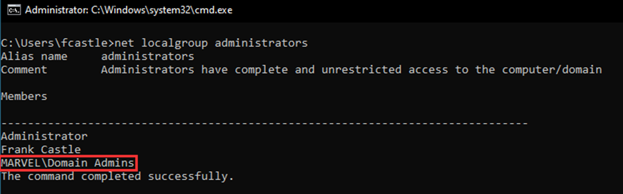

Therefore, this blog focuses on implementing 2 easily digestible controls/principle
of least privilege (PoLP) solutions to mitigate this.

## Secure Administrators Group

Securing the Administrators group is imperative because many user rights in AD and
domain controllers are granted specifically to the Administrators group, not to
Enterprise Admins (EA) or Domain Admins (DA) groups.

Therefore, no regular (day-to-day) user accounts should be part of the
Administrators group, except for the built-in Administrator account for the domain,
provided it is properly secured. There are `2` solutions to securing this group:

### Remove all members from the Administrators group

As mentioned earlier, all members should be removed from the Administrators
group with the possible exception of the built-in Administrator account for the
domain, provided it has been [secured](https://learn.microsoft.com/en-us/windows-server/identity/ad-ds/plan/security-best-practices/appendix-d--securing-built-in-administrator-accounts-in-active-directory).

Caution: The steps illustrated in this blog should be tested thoroughly in a non-
production environment before executing in production.

To implement this:

- Open Server Manager, click Tools > Active Directory Users and Computers.
- Double-click the Administrators group and click the Members tab.

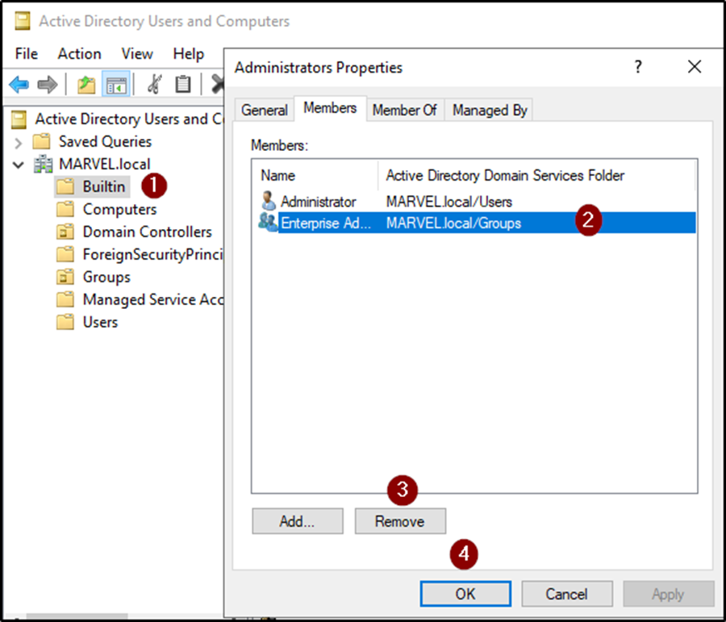

- Select a member of the group, click `Remove` > `Yes` > `OK`.
- Repeat `step 3` until all members of the Administrators group have been
removed.

### Prevent members of the Administrators group from accessing member servers and workstations over the network, logging on as a batch job, and logging on as a service

- In `Server Manager`, click `Tools` > `Group Policy Management`.
- In the console tree, expand <Forest-name>\Domains\<Domain-name>, and then `Group Policy Objects`.

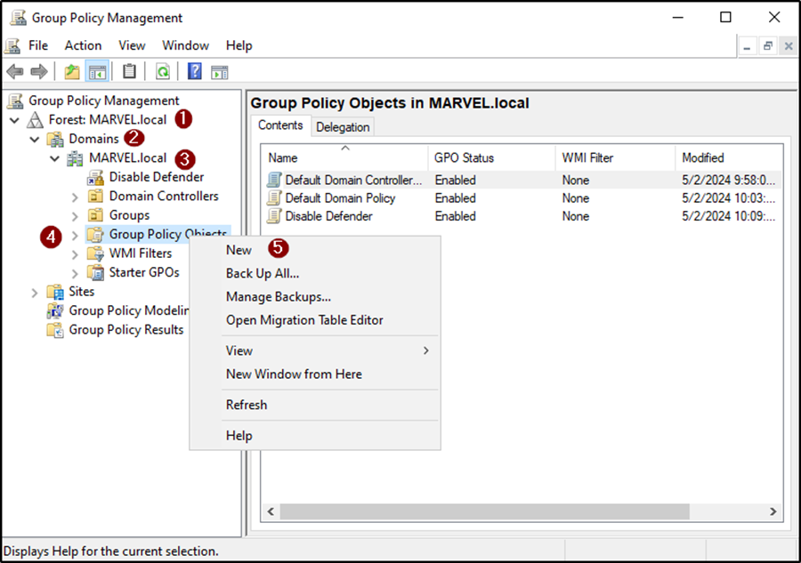

- Specify a name for the GPO in the `New GPO` dialog box and click `OK`.

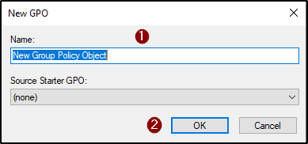

- Right-click on the newly created `GPO Name` in the details pane (left pane)
and click `Edit`.
- Navigate to `Computer Configuration` > `Policies` > `Windows Settings` > `Security Settings` > `Local Policies` and 
double click `User Rights Assignment`.

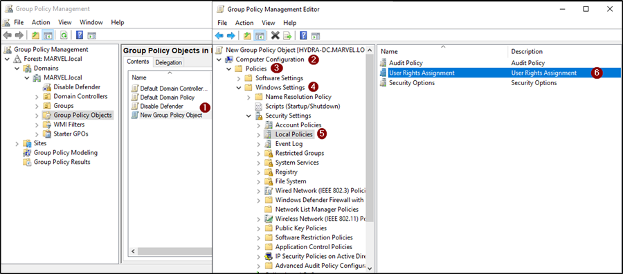

- Double-click `Deny access to this computer from the network` > select `Define these policy settings` > 
`Add User or Group` > click `Browse` > Type `Administrators` > click `Check Names` > click `OK` > `OK`, and `OK`.

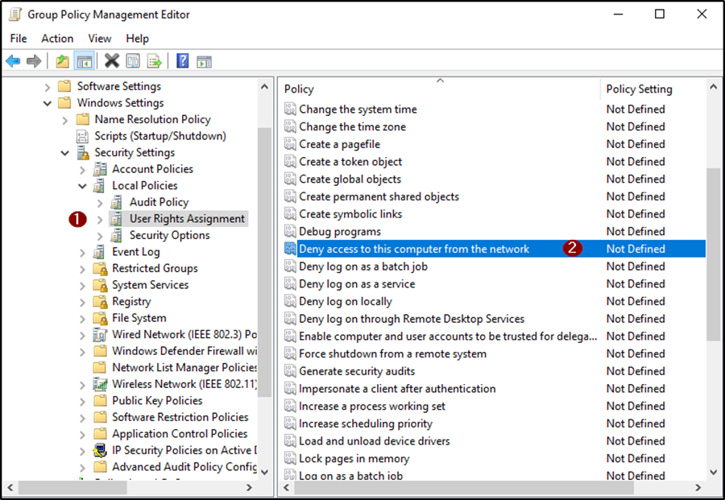
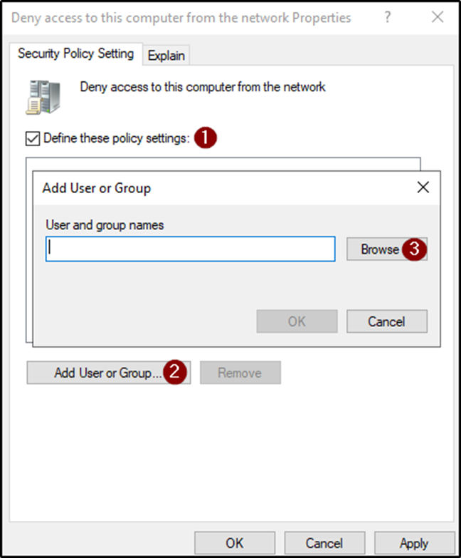
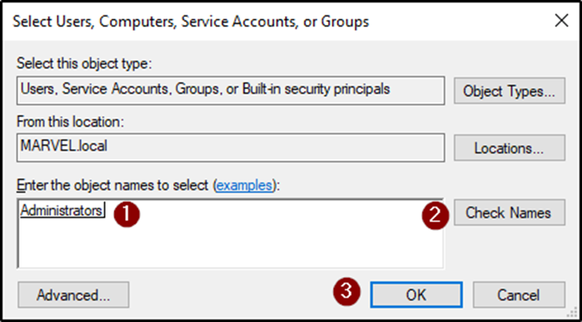

- Repeat step 5 and 6 to prevent members of the Administrators group from
`logging on as a batch job` and `logging on as a service`.

Note: Remember, `Deny access to this computer from the network` in step 6
would be `Deny log on as a batch job` or `Deny log on as a service` respectively.

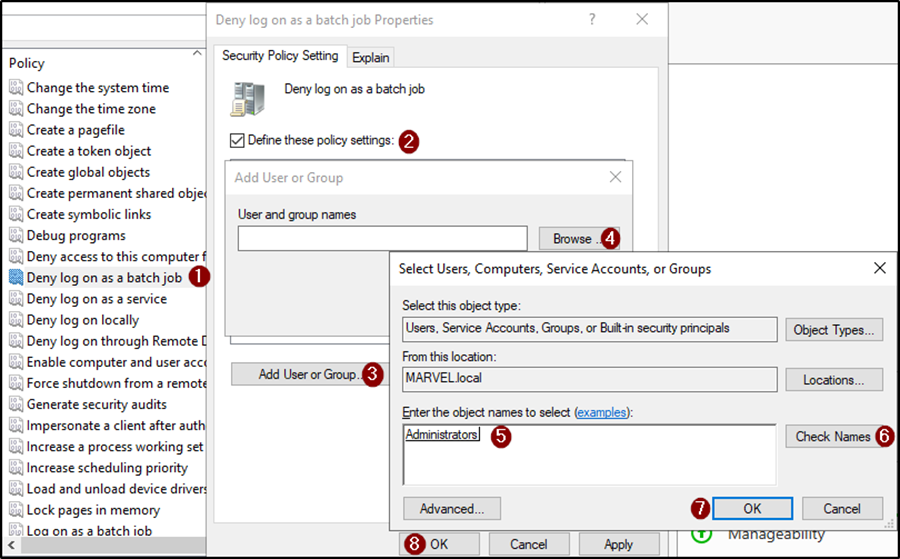
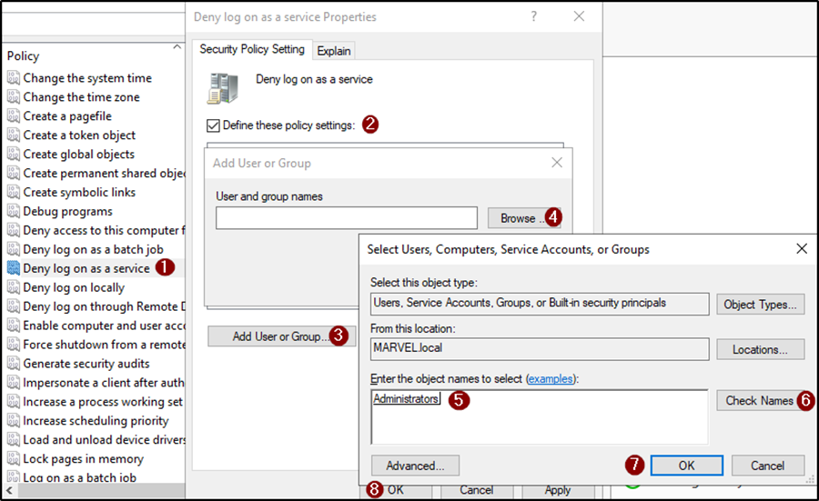

- Link the GPO to the member server and workstation Organizational Units (OUs). Then create 
links to all other OUs that contain workstations and member servers.

#### Caveat regarding this configuration:

- If jump servers are used to administer domain controllers and Active
Directory, ensure that jump servers are located in an OU to which this GPOs
is not linked.
- When you implement restrictions on the Administrators group in GPOs,
Windows applies the settings to members of a computer's local
Administrators group in addition to the domain's Administrators group.
Therefore, you should use caution when implementing restrictions in the
Administrators group. Although prohibiting network, batch, and service
logons for members of the Administrators group is advised wherever it is
feasible to implement, do not restrict local logons or logons through Remote
Desktop Services. Blocking these logon types can block legitimate
administration of a computer by members of the local Administrators group.

## Remove Domain Admins group from having local admin rights on all domain workstations & servers

Domain Admins members typically need elevated privileges for domain-level tasks,
not for everyday operations on individual workstations or servers. Therefore,
replacing Domain Admins with the Workstation Admins or Server Admins group(s)
reduces potential entry points for attackers, enforces Principle of Least Privilege
(PoLP), and prevents them from having local admin rights on all computers.

Caution: Be sure to implement this on OUs containing servers and workstations in
the forest (ensure you target only non-Tier 0 systems, as workstation admins should
not have control over admin systems). This approach will remove Domain Admins
local administrative rights on workstations and servers, and instead, assign these
permissions to dedicated Workstation and Server Admin groups.

#### Steps:

- Create a new GPO with your preferred name and link it to the Workstations OU. 
- Right click the new `GPO` > `Edit` > `Computer Configuration` > `Policies` > `Windows Settings` > 
`Security Settings`. 
- Then right click `Restricted Groups` and click `Add Group`.

- Type `Administrator` in the Group input and click `OK`.

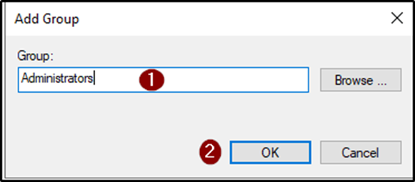

- In Administrators Properties, click `Add` for `“Members of this group”`
- Add the AD group being delegated local administrative rights, in this case its
`MARVEL\Workstation Admins` (naming convention is Domain\ADGroupName).

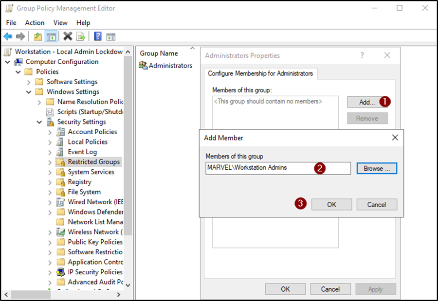

- The final product should look like this:

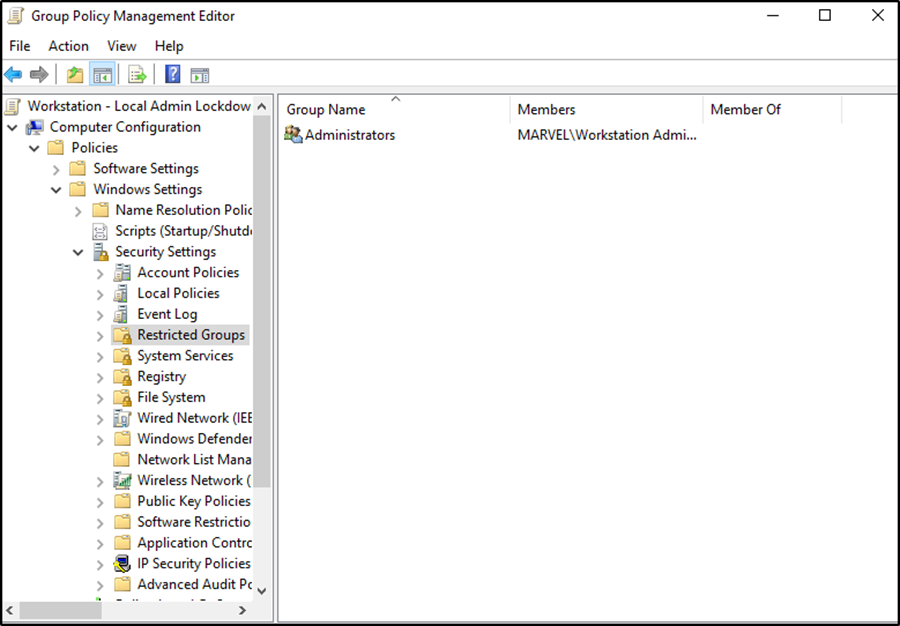

## Conclusion

Fine-tuning controls for privileged accounts within AD is essential to mitigate risks
associated with elevated permissions as well as to alleviate the attack surface for
compromising the domain. Key controls discussed in this blog include securing the
Administrators Group and removing the Domain Admins Group from the local
Administrators Group on all domain-joined servers and workstations.

However, these controls are not exhaustive. Organizations should continually
assess and update their security strategies, incorporate additional best practices
such as regular monitoring and auditing of highly privileged accounts, as well as
Privilege Access Management solutions (PAM) in order to ensure robust protection
of their AD environments.

## References

- [Privileged Accounts and Groups](https://learn.microsoft.com/en-us/windows-server/identity/ad-ds/plan/security-best-practices/appendix-b--privileged-accounts-and-groups-in-active-directory)
- [Tier Zero Accounts](https://techcommunity.microsoft.com/t5/core-infrastructure-and-security/protecting-tier-0-the-modern-way/ba-p/4052851)
- [Least Privileged Administrative Models](https://learn.microsoft.com/en-us/windows-server/identity/ad-ds/plan/security-best-practices/implementing-least-privilege-administrative-models)
- [Appendix G: Securing Administrative Groups in Active Directory](https://learn.microsoft.com/en-us/windows-server/identity/ad-ds/plan/security-best-practices/appendix-g--securing-administrators-groups-in-active-directory)
- [Appendix F: Securing Domain Admins Groups in Active Directory](https://docs.microsoft.com/en-us/windows-server/identity/ad-ds/plan/security-best-practices/appendix-f--securing-domain-admins-groups-in-active-directory)

